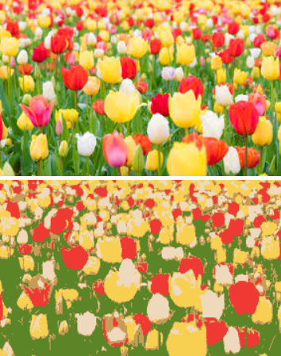

# Image Clustering with K-Means
This project demonstrates image clustering using the K-Means algorithm. It includes functions to perform K-Means clustering on an image and display the original and clustered images.

### Installation
To run this project, you need to have the following libraries installed:

`PIL (Python Imaging Library)`

`numpy`

`sklearn`

You can install the required libraries using pip:
```
pip install pillow numpy scikit-learn
```
## Usage
Import the required libraries:

```
from PIL import Image
import numpy as np
from sklearn.cluster import KMeans
from IPython.display import display
```
* Define the KmeanS function, which performs K-Means clustering using the EM algorithm
* Define the IMG_CLUSTER function, which displays the image after clustering based on user-defined clusters
* Load the image and perform clustering
```
IMG = Image.open('flower.jpg')
IMG_CLUSTER(2, IMG)
```
Run the code and observe the original and clustered images displayed.

## Results
The project uses the K-Means algorithm to cluster an image into the specified number of clusters. The resulting image shows the original image and the clustered image side by side, allowing you to compare the differences in color clustering.

